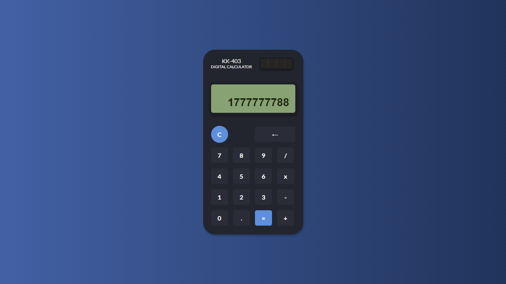

<h1 align="center">
  KK-403 DIGITAL CALCULATOR
</h1>
<p align="center">
    Este é um <a href="https://calculator-mu-murex.vercel.app/" target="_blank">web app</a> de uma simples calculadora inspirada no modelo KK-402.
</p>




## 💬 Sobre o projeto
O projeto foi criado com o simples propósito de exercitar meus conhecimentos de TypeScript e SASS. A calculadora pode efetuar 4 operações básicas de matemática:
-   Adição
-   Subtração
-   Multiplicação
-   Divisão

O usuário pode digitar os números através dos botões, apagar dígitos e transformar números em decimais.

### 🧱 Tecnologias

- React JS
- TypeScript
- SASS
- Jest
- Testing Library

## 🛠 Guia de instalação

1. Faça o clone do projeto
    ```
    git clone https://github.com/jonathanBenedito/calculator.git
    ```

2. Acesse o repositório
    ```
    cd calculator
    ```

3. Instale o pacote do projeto
    ```
    npm install
    ```

4. Inicialize o app
    ```
    npm start
    ```

### 🔗 Links

Website: <a href="https://calculator-mu-murex.vercel.app/">KK-403 Digital Calculator</a><br />